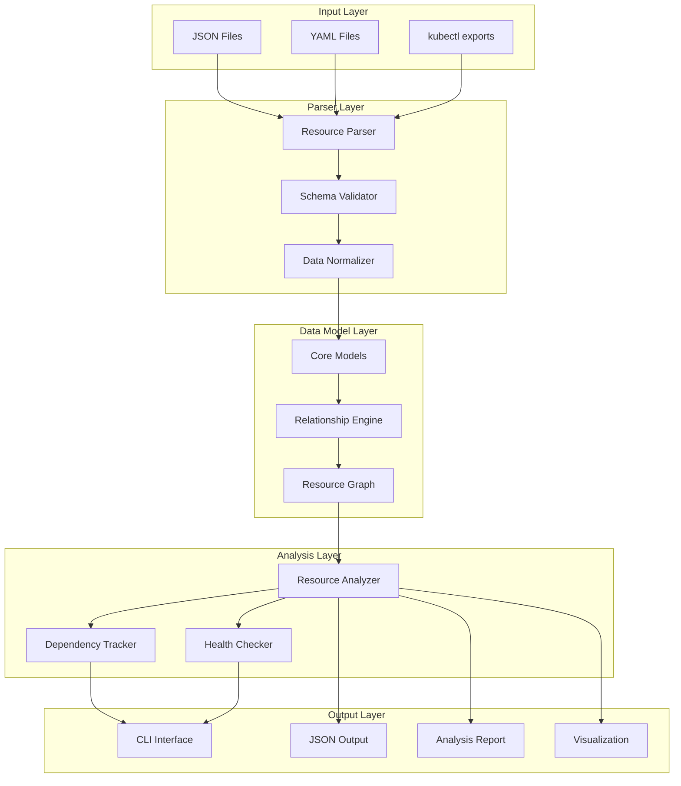

# Kubernetes Resource Analyzer - Design Document

## Overview

A Python application for analyzing Kubernetes cluster exports and building a data model with cross-references between different Kubernetes objects.

## Architecture



## MVP Scope

### Supported Resource Types
1. **ConfigMap** - Configuration data storage
2. **Node** - Cluster nodes information
3. **Pod** - Running workloads
4. **Namespace** - Resource organization
5. **PersistentVolume (PV)** - Cluster storage
6. **PersistentVolumeClaim (PVC)** - Storage requests
7. **RoleBinding** - RBAC permissions
8. **Ingress/Route** - External access
9. **ServiceAccount** - Pod identity
10. **Service** - Network endpoints

### Core Features
- **Resource Parsing**: Parse kubectl JSON/YAML exports
- **Data Modeling**: Structured representation of resources
- **Relationship Mapping**: Cross-references between objects
- **Dependency Analysis**: Resource dependencies and ownership
- **Health Assessment**: Basic resource health checks
- **Export Capabilities**: JSON output and analysis reports

## Data Model

### Base Resource Model
```python
@dataclass
class KubernetesResource:
    api_version: str
    kind: str
    metadata: ResourceMetadata
    spec: Dict[str, Any]
    status: Optional[Dict[str, Any]]
    relationships: List[ResourceRelationship]
```

### Relationship Model
```python
@dataclass
class ResourceRelationship:
    source_resource: ResourceReference
    target_resource: ResourceReference
    relationship_type: RelationshipType
    direction: RelationshipDirection
```

### Relationship Types
- **OWNS**: Resource owns another (e.g., Deployment owns ReplicaSet)
- **USES**: Resource uses another (e.g., Pod uses ConfigMap)
- **EXPOSES**: Resource exposes another (e.g., Service exposes Pod)
- **BINDS**: Resource binds to another (e.g., PVC binds to PV)
- **REFERENCES**: Resource references another (e.g., Pod references ServiceAccount)

## Technology Stack

- **Language**: Python 3.11+
- **Package Manager**: uv
- **Core Libraries**:
  - `pydantic` - Data validation and modeling
  - `typer` - CLI framework
  - `pyyaml` - YAML parsing
  - `rich` - Terminal UI and formatting
  - `networkx` - Graph analysis
  - `jinja2` - Report templating

## CLI Interface

```bash
k8s-analyzer [OPTIONS] COMMAND [ARGS]...

Commands:
  parse       Parse kubectl export files
  analyze     Analyze parsed resources
  report      Generate analysis report
  graph       Visualize resource relationships
  validate    Validate resource configurations
```

## Output Formats

1. **JSON**: Structured data model with relationships
2. **HTML Report**: Human-readable analysis with visualizations
3. **Graph**: Network diagram of resource relationships
4. **CSV**: Tabular data for further processing

## Implementation Phases

### Phase 1: Core Parsing (MVP)
- Resource parsers for target types
- Basic data model
- Simple relationship detection
- JSON output

### Phase 2: Analysis Engine
- Advanced relationship mapping
- Dependency analysis
- Health assessment
- CLI interface

### Phase 3: Visualization & Reporting
- HTML report generation
- Graph visualization
- Export capabilities
- Configuration validation
