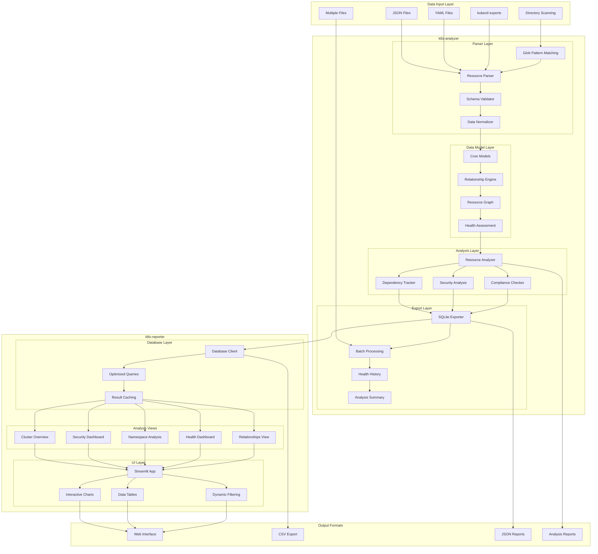

# Kubernetes Analysis Toolkit - Design Document

## Overview

A comprehensive Python toolkit for analyzing Kubernetes cluster data, consisting of two integrated applications:

1. **k8s-analyzer**: CLI tool for parsing, analyzing, and exporting Kubernetes resource data to SQLite databases
2. **k8s-reporter**: Web UI for interactive visualization and analysis of Kubernetes cluster data

The toolkit provides end-to-end capabilities from raw kubectl exports to interactive dashboards with advanced analytics.

## System Architecture



## Applications Architecture

### k8s-analyzer (CLI Tool)

#### Core Capabilities
- **Multi-file Processing**: Batch processing with configurable batch sizes
- **Directory Scanning**: Automatic discovery using glob patterns
- **Relationship Analysis**: Advanced cross-resource dependency mapping
- **Health Assessment**: Resource health evaluation and issue tracking
- **SQLite Export**: Structured database export with optimized schema
- **Progress Reporting**: Real-time progress for large datasets

#### CLI Commands
```bash
# Core Analysis
k8s-analyzer parse <file>                    # Parse single file
k8s-analyzer analyze <file>                  # Full analysis with relationships
k8s-analyzer report <file>                   # Generate HTML report
k8s-analyzer graph <file>                    # Relationship visualization
k8s-analyzer validate <file>                 # Configuration validation

# Batch Processing
k8s-analyzer scan <directory>                # Parse directory
k8s-analyzer batch-analyze <directory>       # Full directory analysis
k8s-analyzer list-files <directory>          # List discoverable files

# SQLite Export
k8s-analyzer export-sqlite <file> <db>       # Export single file
k8s-analyzer export-multiple-sqlite files... -d <db>  # Export multiple files
k8s-analyzer export-directory-sqlite <dir> <db>       # Export entire directory

# Database Operations
k8s-analyzer query-db <db>                   # Query SQLite database
k8s-analyzer db-summary <db>                 # Database statistics
k8s-analyzer export-csv <db> <dir>           # Export to CSV
```

### k8s-reporter (Web UI)

#### Architecture Components
- **Streamlit Framework**: Modern web application framework
- **Database Client**: High-performance SQLite interface
- **Analysis Views**: Specialized dashboard components
- **Interactive Charts**: Plotly-based visualizations
- **Real-time Filtering**: Dynamic data exploration

#### Analysis Views
1. **🏠 Cluster Overview**: Health metrics, resource distribution, top namespaces
2. **🔒 Security Analysis**: RBAC insights, pod security evaluation, recommendations
3. **🏷️ Namespace Analysis**: Per-namespace breakdowns and health status
4. **❤️ Health Dashboard**: Resource health monitoring and issue tracking
5. **🔗 Relationship Analysis**: Resource dependencies and interaction mapping
6. **⚡ Resource Efficiency**: (Future) Optimization recommendations
7. **✅ Compliance Report**: (Future) Policy compliance checking
8. **📈 Trends Analysis**: (Future) Historical trend analysis

#### Launch Options
```bash
k8s-reporter                                 # Launch web UI
k8s-reporter --port 8080                     # Custom port
k8s-reporter --database cluster.db           # Pre-load database
k8s-reporter --headless --host 0.0.0.0       # Server deployment
```

## Data Model

### Enhanced Resource Model
```python
class KubernetesResource(BaseModel):
    api_version: str
    kind: str
    metadata: ResourceMetadata
    spec: Dict[str, Any]
    status: Optional[Dict[str, Any]]
    relationships: List[ResourceRelationship]
    health_status: ResourceStatus  # NEW
    issues: List[str]              # NEW
```

### SQLite Database Schema
```sql
-- Resources table with health tracking
CREATE TABLE resources (
    id INTEGER PRIMARY KEY,
    uid TEXT UNIQUE,
    name TEXT NOT NULL,
    namespace TEXT,
    kind TEXT NOT NULL,
    health_status TEXT NOT NULL,
    issues TEXT,  -- JSON array
    labels TEXT,  -- JSON object
    spec TEXT,    -- JSON object
    status TEXT,  -- JSON object
    created_at DATETIME DEFAULT CURRENT_TIMESTAMP
);

-- Relationships with strength metrics
CREATE TABLE relationships (
    id INTEGER PRIMARY KEY,
    source_uid TEXT NOT NULL,
    target_resource TEXT NOT NULL,
    relationship_type TEXT NOT NULL,
    strength REAL DEFAULT 1.0,
    description TEXT,
    FOREIGN KEY (source_uid) REFERENCES resources (uid)
);

-- Health history for trend analysis
CREATE TABLE resource_health_history (
    id INTEGER PRIMARY KEY,
    resource_uid TEXT NOT NULL,
    health_status TEXT NOT NULL,
    issues TEXT,
    timestamp DATETIME NOT NULL,
    FOREIGN KEY (resource_uid) REFERENCES resources (uid)
);

-- Analysis summary metadata
CREATE TABLE analysis_summary (
    id INTEGER PRIMARY KEY,
    analysis_timestamp DATETIME NOT NULL,
    total_resources INTEGER NOT NULL,
    total_relationships INTEGER NOT NULL,
    health_summary TEXT,  -- JSON object
    resource_types TEXT   -- JSON object
);
```

### Relationship Types
- **OWNS**: Resource owns another (e.g., Deployment owns ReplicaSet)
- **USES**: Resource uses another (e.g., Pod uses ConfigMap)
- **EXPOSES**: Resource exposes another (e.g., Service exposes Pod)
- **BINDS**: Resource binds to another (e.g., PVC binds to PV)
- **REFERENCES**: Resource references another (e.g., Pod references ServiceAccount)
- **DEPENDS_ON**: Resource depends on another (e.g., Pod depends on Node)
- **MANAGES**: Resource manages another (e.g., ReplicaSet manages Pods)
- **SELECTS**: Resource selects another (e.g., Service selects Pods)

### Health Status Model
```python
class ResourceStatus(str, Enum):
    HEALTHY = "healthy"     # Resource is functioning correctly
    WARNING = "warning"     # Resource has issues but is functional
    ERROR = "error"         # Resource has critical issues
    UNKNOWN = "unknown"     # Resource status cannot be determined
```

## Supported Resource Types

### Current Support (MVP)
1. **Pod** - Running workloads and containers
2. **Service** - Network endpoints and load balancing
3. **ConfigMap** - Configuration data storage
4. **Node** - Cluster nodes information
5. **Namespace** - Resource organization and isolation
6. **PersistentVolume (PV)** - Cluster storage resources
7. **PersistentVolumeClaim (PVC)** - Storage requests
8. **RoleBinding** - RBAC permissions
9. **Ingress** - External access routing
10. **ServiceAccount** - Pod identity and authentication

### Extended Support (Future)
- **Deployment** - Declarative application updates
- **ReplicaSet** - Pod replication management
- **StatefulSet** - Stateful application management
- **DaemonSet** - Node-level pod management
- **Job** - Batch processing workloads
- **CronJob** - Scheduled batch processing
- **Secret** - Sensitive data storage
- **HorizontalPodAutoscaler** - Auto-scaling configuration
- **NetworkPolicy** - Network traffic rules
- **ResourceQuota** - Resource consumption limits

## Technology Stack

### k8s-analyzer
- **Language**: Python 3.11+
- **Package Manager**: uv
- **Core Libraries**:
  - `pydantic` - Data validation and modeling
  - `typer` - CLI framework with rich features
  - `pyyaml` - YAML parsing and processing
  - `rich` - Terminal UI and beautiful formatting
  - `networkx` - Graph analysis and algorithms
  - `jinja2` - Report templating
  - `sqlite3` - Database operations
  - `pandas` - Data manipulation and analysis

### k8s-reporter
- **Framework**: Streamlit (web application)
- **Visualization**: Plotly (interactive charts)
- **Data Processing**: Pandas (data manipulation)
- **Database**: SQLite3 (data storage)
- **UI Components**: Streamlit-aggrid (advanced tables)
- **Styling**: Custom CSS and themes

## Advanced Features

### Multi-file Processing
- **Batch Processing**: Handle thousands of files efficiently
- **Pattern Matching**: Glob patterns for file discovery
- **Progress Tracking**: Real-time progress for large datasets
- **Error Recovery**: Graceful handling of malformed files
- **Memory Optimization**: Process files in configurable batches

### Database Capabilities
- **Optimized Schema**: Indexed tables for fast queries
- **Health History**: Track resource health changes over time
- **Relationship Storage**: Efficient relationship mapping
- **Query Interface**: High-level query methods
- **Export Options**: CSV export for external analysis

### Web UI Features
- **Interactive Filtering**: Real-time data exploration
- **Search Functionality**: Find resources by name or type
- **Responsive Design**: Works on desktop, tablet, and mobile
- **File Upload**: Drag-and-drop database upload
- **Dynamic Charts**: Interactive Plotly visualizations
- **Data Tables**: Sortable, filterable tables

## Security Analysis

### Pod Security Assessment
- **Privileged Containers**: Detect privileged pod execution
- **Security Context**: Evaluate security context configurations
- **Root User Detection**: Identify containers running as root
- **Capability Analysis**: Review container capabilities

### RBAC Analysis
- **Service Account Usage**: Track service account assignments
- **Role Binding Analysis**: Evaluate RBAC permissions
- **Privilege Escalation**: Identify potential security risks
- **Permission Mapping**: Visualize access patterns

## Performance Considerations

### k8s-analyzer Optimizations
- **Streaming Processing**: Handle large files without loading entirely into memory
- **Parallel Processing**: Multi-threaded parsing for large datasets
- **Incremental Analysis**: Process new files without re-analyzing existing data
- **Caching**: Cache parsed results for faster subsequent runs

### k8s-reporter Optimizations
- **Database Indexing**: Optimized SQLite indexes for fast queries
- **Result Caching**: Cache expensive query results
- **Lazy Loading**: Load data only when needed
- **Pagination**: Handle large datasets efficiently

## Deployment Scenarios

### Development Environment
```bash
# Local development with hot reload
k8s-analyzer export-directory-sqlite ./manifests cluster.db
k8s-reporter --database cluster.db
```

### CI/CD Integration
```bash
# Automated analysis in pipelines
k8s-analyzer export-multiple-sqlite *.yaml -d analysis.db
k8s-reporter --headless --host 0.0.0.0 --database analysis.db
```

### Enterprise Deployment
```bash
# Large-scale cluster analysis
k8s-analyzer export-directory-sqlite /cluster-exports production.db --batch-size 50
k8s-reporter --host 0.0.0.0 --port 8080 --database production.db
```

## Future Enhancements

### Phase 1: Advanced Analytics
- **Resource Efficiency Analysis**: CPU/memory optimization recommendations
- **Cost Analysis**: Resource cost breakdown and optimization
- **Capacity Planning**: Resource usage trends and projections
- **Compliance Reporting**: Policy compliance checking

### Phase 2: Multi-cluster Support
- **Cluster Comparison**: Compare configurations across clusters
- **Migration Planning**: Identify differences and migration paths
- **Cross-cluster Analytics**: Aggregate insights across environments

### Phase 3: Real-time Integration
- **Live Cluster Connection**: Direct kubectl integration
- **Real-time Monitoring**: Live health status updates
- **Alert Integration**: Integration with monitoring systems
- **Automated Remediation**: Suggested fixes for detected issues

### Phase 4: Advanced Visualizations
- **3D Cluster Maps**: Interactive 3D resource topology
- **Timeline Analysis**: Resource lifecycle visualization
- **Custom Dashboards**: User-defined dashboard creation
- **Export Capabilities**: PDF/PowerPoint report generation

## Integration Points

### GitOps Workflows
- **Manifest Analysis**: Analyze Git-stored Kubernetes manifests
- **PR Integration**: Automated analysis on pull requests
- **Drift Detection**: Compare desired vs actual cluster state

### Monitoring Integration
- **Prometheus Metrics**: Export analysis metrics
- **Alerting**: Integration with AlertManager
- **Grafana Dashboards**: Custom Grafana dashboard templates

### Security Tools
- **Policy Engines**: Integration with OPA/Gatekeeper
- **Vulnerability Scanning**: Correlate with security scan results
- **Compliance Frameworks**: Map to CIS, NIST, SOC2 requirements

## Success Metrics

### Technical Metrics
- **Processing Speed**: Files per second analysis capability
- **Database Performance**: Query response times
- **Memory Efficiency**: Memory usage for large datasets
- **Error Handling**: Graceful failure recovery rate

### User Experience Metrics
- **Time to Insight**: Time from data upload to actionable insights
- **User Adoption**: Dashboard usage patterns
- **Feature Utilization**: Most-used analysis views
- **Performance Satisfaction**: User-reported performance ratings

### Business Impact
- **Issue Detection**: Number of configuration issues identified
- **Security Improvements**: Security vulnerabilities discovered
- **Operational Efficiency**: Time saved in cluster analysis
- **Compliance Achievement**: Compliance requirements met
