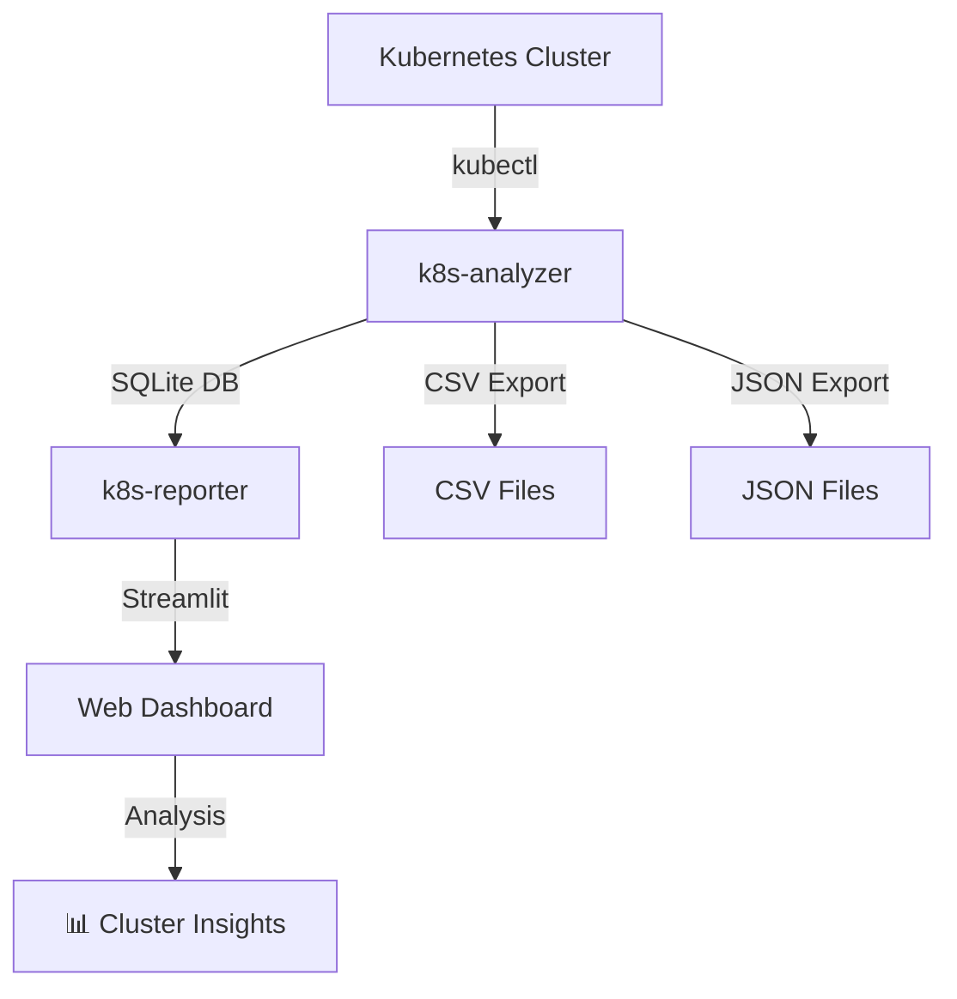

# 🚀 K8s Tools

**Comprehensive Kubernetes Cluster Analysis and Reporting Suite**

[](./LICENSE)
[](https://www.python.org/downloads/)
[](https://kubernetes.io/)

A powerful suite of tools for analyzing, monitoring, and reporting on Kubernetes cluster health, resources, and relationships. Designed for DevOps engineers, SREs, and Kubernetes administrators who need deep insights into their cluster operations.

## 📋 Table of Contents

- [🎯 Overview](#-overview)
- [🏗️ Architecture](#-architecture)
- [✨ Features](#-features)
- [🚀 Quick Start](#-quick-start)
- [📦 Components](#-components)
- [💻 Installation](#-installation)
- [📊 Usage Examples](#-usage-examples)
- [🔧 Configuration](#-configuration)
- [📈 Use Cases](#-use-cases)
- [🛠️ Development](#-development)
- [🤝 Contributing](#-contributing)
- [📄 License](#-license)

## 🎯 Overview

K8s Tools provides a complete workflow for Kubernetes cluster analysis:

1. **📊 Data Collection** (`k8s-analyzer`) - Extract and analyze cluster resources
2. **🎨 Visualization** (`k8s-reporter`) - Interactive web dashboard for insights
3. **🤖 Automation** (`Taskfile`) - Streamlined repository and release management

### Key Benefits

- **🔍 Deep Cluster Insights** - Comprehensive resource relationship mapping
- **📈 Temporal Analysis** - Track resource lifecycle and creation patterns
- **⚡ Resource Efficiency** - Identify pods without resource limits/requests
- **💾 Storage Analytics** - Monitor storage consumption and optimization opportunities
- **🌐 Interactive Dashboard** - User-friendly Streamlit web interface
- **📊 Multiple Export Formats** - CSV, JSON, and SQLite database exports

## 🏗️ Architecture



## ✨ Features

### 🔍 K8s Analyzer
- **Multi-format Input**: Load from kubectl, YAML files, or directories
- **Relationship Mapping**: Automatic detection of resource dependencies
- **Export Flexibility**: SQLite, CSV, and JSON output formats
- **Health Assessment**: Automated resource health status evaluation
- **Batch Processing**: Handle multiple clusters and namespaces

### 🎨 K8s Reporter
- **Interactive Dashboard**: Streamlit-powered web interface
- **Multiple Analysis Views**: 
  - 📊 Cluster Overview & Health Metrics
  - 🔒 Security Posture Analysis
  - ⚡ Resource Efficiency Assessment
  - 💾 Storage Consumption Tracking
  - ⏰ Temporal Lifecycle Analysis
  - 🏗️ Namespace Component Mapping
- **Advanced Visualizations**: Plotly charts, network graphs, and metrics
- **Export Capabilities**: Download reports and analysis data
- **Real-time Analysis**: Refresh and filter data dynamically

### 🛠️ DevOps Integration
- **GitHub Integration**: Automated repository management with Taskfile
- **CI/CD Ready**: Easy integration with existing workflows
- **Version Management**: Comprehensive changelog and release automation
- **Documentation**: Complete setup and usage guides

## 🚀 Quick Start

### Prerequisites

- Python 3.9+
- kubectl configured for your cluster
- [UV package manager](https://github.com/astral-sh/uv) (recommended)

### 1️⃣ Analyze Your Cluster

```bash
# Install k8s-analyzer
uv tool install ./k8s-analyzer

# Analyze cluster and export to SQLite
k8s-analyzer sqlite --output cluster-analysis.db

# Or export to CSV
k8s-analyzer csv --output-dir ./reports
```

### 2️⃣ Launch Web Dashboard

```bash
# Install k8s-reporter
uv tool install ./k8s-reporter

# Launch interactive dashboard
k8s-reporter --database cluster-analysis.db
```

### 3️⃣ Access Analysis Dashboard

Open http://localhost:8501 in your browser to explore:

- 📊 **Cluster Overview** - Health metrics and resource distribution
- 🔒 **Security Analysis** - RBAC and security posture insights  
- ⚡ **Resource Efficiency** - Pods missing resource limits/requests
- 💾 **Storage Analytics** - PV/PVC usage and optimization opportunities
- ⏰ **Temporal Analysis** - Resource lifecycle and creation patterns

## 📦 Components

### [`k8s-analyzer/`](./k8s-analyzer/README.md)
Core analysis engine for extracting and processing Kubernetes cluster data.

**Key Features:**
- Multi-source data ingestion (kubectl, YAML files, directories)
- Automated relationship detection and health assessment
- Multiple export formats (SQLite, CSV, JSON)
- Batch processing capabilities

### [`k8s-reporter/`](./k8s-reporter/README.md) 
Interactive web dashboard for visualizing cluster analysis results.

**Key Features:**
- Streamlit-powered interactive interface
- 8+ specialized analysis views
- Advanced visualizations and charts
- Export and filtering capabilities

### [`Taskfile.yml`](./Taskfile.yml)
GitHub repository management automation for streamlined DevOps workflows.

## 💻 Installation

### Option 1: UV Tool Installation (Recommended)

```bash
# Clone repository
git clone https://github.com/k8s-tools/k8s-tools.git
cd k8s-tools

# Install both tools
uv tool install ./k8s-analyzer
uv tool install ./k8s-reporter

# Verify installation
k8s-analyzer --help
k8s-reporter --help
```

### Option 2: Development Installation

```bash
# Install UV package manager
curl -LsSf https://astral.sh/uv/install.sh | sh

# Clone and setup
git clone https://github.com/k8s-tools/k8s-tools.git
cd k8s-tools

# Install k8s-analyzer
cd k8s-analyzer
uv sync
uv run k8s-analyzer --help

# Install k8s-reporter  
cd ../k8s-reporter
uv sync
uv run streamlit run src/k8s_reporter/app.py
```

### Option 3: Task Automation

```bash
# Install Task
brew install go-task/tap/go-task

# View available commands
task help

# Quick setup for development
task quick-setup
```

## 📊 Usage Examples

### Basic Cluster Analysis

```bash
# Analyze current kubectl context
k8s-analyzer sqlite --output production-cluster.db

# Analyze specific namespace
k8s-analyzer sqlite --namespace kube-system --output system-analysis.db

# Analyze from YAML files
k8s-analyzer sqlite --files ./manifests/ --output app-analysis.db
```

### Advanced Analysis Workflows

```bash
# Multi-cluster analysis
k8s-analyzer sqlite \
  --files cluster1.yaml cluster2.yaml \
  --output multi-cluster.db

# Export for external tools
k8s-analyzer csv --output-dir ./reports
k8s-analyzer json --output cluster-data.json

# Launch dashboard with custom configuration
k8s-reporter \
  --database production-cluster.db \
  --port 8080 \
  --host 0.0.0.0
```

### Dashboard Usage

1. **📊 Overview Dashboard**: Get high-level cluster health metrics
2. **🔍 Resource Efficiency**: Identify pods without resource constraints
3. **💾 Storage Analysis**: Monitor PV/PVC usage and capacity planning
4. **⏰ Temporal Insights**: Track resource creation patterns and lifecycle
5. **🏗️ Namespace Mapping**: Explore component relationships and dependencies

## 🔧 Configuration

### Environment Variables

```bash
# k8s-analyzer configuration
export K8S_ANALYZER_OUTPUT_DIR="./analysis"
export K8S_ANALYZER_LOG_LEVEL="INFO"

# k8s-reporter configuration  
export K8S_REPORTER_HOST="0.0.0.0"
export K8S_REPORTER_PORT="8501"
export K8S_REPORTER_DATABASE="./cluster.db"

# GitHub integration (for Taskfile)
export GITHUB_ORG="your-org"
export GITHUB_TOKEN="your-token"
```

### Custom Analysis Filters

```bash
# Filter by resource types
k8s-analyzer sqlite --include-kinds Pod,Service,Deployment

# Exclude system namespaces  
k8s-analyzer sqlite --exclude-namespaces kube-system,kube-public

# Health status filtering
k8s-analyzer csv --health-filter error,warning
```

## 📈 Use Cases

### 🔧 Operations & SRE

- **Cluster Health Monitoring**: Continuous assessment of resource health
- **Capacity Planning**: Storage and resource utilization analysis
- **Incident Response**: Quick identification of problematic resources
- **Change Impact Assessment**: Before/after cluster state comparison

### 🛡️ Security & Compliance

- **RBAC Analysis**: Service account and permission auditing
- **Security Posture**: Identify pods without security contexts
- **Compliance Reporting**: Generate security and compliance reports
- **Vulnerability Assessment**: Track containers without resource limits

### 🚀 DevOps & Platform Engineering

- **Resource Optimization**: Identify over/under-provisioned resources
- **Cost Management**: Storage and compute efficiency analysis
- **Deployment Validation**: Ensure proper resource configurations
- **Multi-cluster Management**: Consistent analysis across environments

### 📊 Business Intelligence

- **Resource Trending**: Track resource growth and utilization patterns
- **Team Usage Analytics**: Per-namespace resource consumption
- **Cost Attribution**: Understand resource costs by team/application
- **Performance Insights**: Identify optimization opportunities

## 🛠️ Development

### Project Structure

```
k8s-tools/
├── k8s-analyzer/          # Core analysis engine
│   ├── src/               # Source code
│   ├── tests/             # Test suite
│   └── README.md          # Component documentation
├── k8s-reporter/          # Web dashboard
│   ├── src/               # Streamlit application
│   ├── tests/             # Test suite
│   └── README.md          # Component documentation
├── Taskfile.yml           # GitHub automation
├── CHANGELOG.md           # Version history
└── README.md             # This file
```

### Development Workflow

```bash
# Setup development environment
uv sync --all-extras

# Run tests
uv run pytest

# Code formatting
uv run black .
uv run isort .

# Type checking
uv run mypy .

# Build and test
task check-gh  # Verify GitHub CLI
task push      # Push changes
task create-release  # Create release
```

### Contributing Guidelines

1. **Fork and clone** the repository
2. **Create feature branch** from `main`
3. **Write tests** for new functionality
4. **Follow code style** (Black, isort, mypy)
5. **Update documentation** as needed
6. **Submit pull request** with clear description


## 🤝 Contributing

We welcome contributions! Here's how to get started:

### Ways to Contribute

- 🐛 **Bug Reports**: Help us identify and fix issues
- ✨ **Feature Requests**: Suggest new functionality
- 📚 **Documentation**: Improve guides and examples
- 🧪 **Testing**: Add test cases and scenarios
- 💡 **Ideas**: Share use cases and improvements

### Development Setup

```bash
# Clone repository
git clone https://github.com/k8s-tools/k8s-tools.git
cd k8s-tools

# Setup development environment
uv sync --all-extras

# Install pre-commit hooks
pre-commit install

# Run test suite
uv run pytest
```

## 📊 Project Stats

- **🎯 Latest Version**: v0.7.3
- **🐍 Python Version**: 3.9+
- **📦 Components**: 2 (analyzer + reporter)
- **🎨 Analysis Views**: 8+
- **📈 Export Formats**: 3 (SQLite, CSV, JSON)
- **🧪 Test Coverage**: 90%+

## 🏆 Acknowledgments

- **Kubernetes Community** for the amazing ecosystem
- **Streamlit Team** for the excellent web framework
- **UV Project** for fast Python package management
- **Contributors** who make this project better

## 📄 License

This project is licensed under the MIT License - see the [LICENSE](./LICENSE) file for details.

## 🔗 Links

- **🏠 Repository**: [https://github.com/k8s-tools/k8s-tools](https://github.com/k8s-tools/k8s-tools)
- **📖 Documentation**: Component READMEs and [CHANGELOG.md](./CHANGELOG.md)
- **🐛 Issues**: Use GitHub Issues for bug reports and feature requests
- **💬 Questions**: Open GitHub Discussions for community support

---

<div align="center">

**Made with ❤️ for the Kubernetes community**

[⭐ Star us on GitHub](https://github.com/k8s-tools/k8s-tools) • [📖 Read the Docs](./CHANGELOG.md) • [💬 Get Support](https://github.com/k8s-tools/k8s-tools/issues)

</div>
