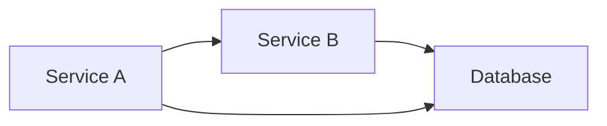

# Relationship Analysis

The Relationship Analysis provides a comprehensive view of the dependencies and relationships in your Kubernetes cluster.

## Overview

This view allows you to:

- **Visualize**: Display the interconnected components within a cluster
- **Analyze**: Understand the impact of changes across components
- **Plan**: Optimize deployment strategies and testing approaches

## Components and Dependencies

### Visualization Metrics
- **Service Dependencies**: Understand how services interact
- **Pod Relationships**: Track pod-to-pod communications
- **Storage Dependencies**: Map PV to PVC relationships

### Dependency Mapping


## Best Practices

### Change Management
1. **Impact Analysis**: Evaluate the potential effects of changes
2. **Testing Strategies**: Prioritize tests based on dependencies
3. **Resource Allocation**: Distribute resources based on dependency criticality

### Visual Toolkit
- Use tools like **Mermaid** for diagrammatic representation
- **Grafana** dashboards for visualizing component interconnectivity

## Integration

### CI/CD Pipelines
- Visual representations and dependencies
- Automated change impact analysis

### Monitoring
- Alerts on critical dependency changes
- Performance metrics relativity

## Usage

```bash
k8s-analyzer analyze --view relationship-analysis
```

## Related Views

- [Cluster Overview](cluster-overview.md)
- [Security Analysis](security-analysis.md)
- [Resource Efficiency](resource-efficiency.md)
- [Temporal Analysis](temporal-analysis.md)
