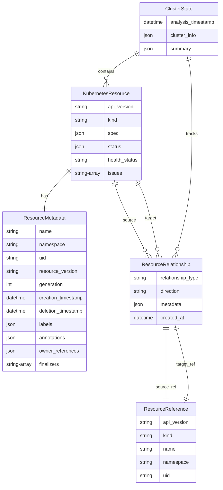

# 📋 k8s-analyzer Data Models

This document describes the data models and structures used by k8s-analyzer for representing Kubernetes resources, relationships, and analysis results.

## Core Data Models

### KubernetesResource

The primary model representing a Kubernetes resource.

```python
class KubernetesResource(BaseModel):
    api_version: str
    kind: str
    metadata: ResourceMetadata
    spec: Dict[str, Any] = Field(default_factory=dict)
    status: Optional[Dict[str, Any]] = None
    relationships: List[ResourceRelationship] = Field(default_factory=list)
    health_status: ResourceStatus = ResourceStatus.UNKNOWN
    issues: List[str] = Field(default_factory=list)
```

**Fields:**
- `api_version`: Kubernetes API version (e.g., "v1", "apps/v1")
- `kind`: Resource type (e.g., "Pod", "Service", "Deployment")
- `metadata`: Resource metadata including name, namespace, labels, etc.
- `spec`: Resource specification as defined in Kubernetes
- `status`: Current status of the resource (optional)
- `relationships`: List of relationships to other resources
- `health_status`: Computed health status
- `issues`: List of identified configuration issues

**Properties:**
- `ref`: Returns a ResourceReference for this resource
- `full_name`: Returns namespace/name or just name for cluster-scoped resources

### ResourceMetadata

Contains Kubernetes resource metadata.

```python
class ResourceMetadata(BaseModel):
    name: str
    namespace: Optional[str] = None
    uid: Optional[str] = None
    resource_version: Optional[str] = None
    generation: Optional[int] = None
    creation_timestamp: Optional[datetime] = None
    deletion_timestamp: Optional[datetime] = None
    labels: Dict[str, str] = Field(default_factory=dict)
    annotations: Dict[str, str] = Field(default_factory=dict)
    owner_references: List[Dict[str, Any]] = Field(default_factory=list)
    finalizers: List[str] = Field(default_factory=list)
```

**Key Fields:**
- `name`: Resource name (required)
- `namespace`: Namespace (None for cluster-scoped resources)
- `uid`: Unique identifier assigned by Kubernetes
- `creation_timestamp`: When the resource was created
- `labels`: Key-value pairs for resource identification
- `annotations`: Key-value pairs for additional metadata
- `owner_references`: References to resources that own this resource

### ResourceReference

Lightweight reference to a Kubernetes resource.

```python
class ResourceReference(BaseModel):
    api_version: str
    kind: str
    name: str
    namespace: Optional[str] = None
    uid: Optional[str] = None
```

**Usage:**
- Used in relationships to reference target resources
- Provides string representation and hashing for collections
- Enables efficient lookups and comparisons

### ResourceRelationship

Represents a relationship between two Kubernetes resources.

```python
class ResourceRelationship(BaseModel):
    source: ResourceReference
    target: ResourceReference
    relationship_type: RelationshipType
    direction: RelationshipDirection = RelationshipDirection.OUTBOUND
    metadata: Dict[str, Any] = Field(default_factory=dict)
```

**Fields:**
- `source`: Source resource reference
- `target`: Target resource reference
- `relationship_type`: Type of relationship (see RelationshipType enum)
- `direction`: Direction of the relationship
- `metadata`: Additional relationship metadata

## Enumerations

### RelationshipType

Defines the types of relationships between resources.

```python
class RelationshipType(str, Enum):
    OWNS = "owns"              # Resource owns another (Deployment owns ReplicaSet)
    USES = "uses"              # Resource uses another (Pod uses ConfigMap)
    EXPOSES = "exposes"        # Resource exposes another (Service exposes Pod)
    BINDS = "binds"            # Resource binds to another (PVC binds to PV)
    REFERENCES = "references"   # Resource references another (Pod references ServiceAccount)
    DEPENDS_ON = "depends_on"   # Resource depends on another (Pod depends on Node)
    MANAGES = "manages"         # Resource manages another (ReplicaSet manages Pods)
    SELECTS = "selects"         # Resource selects another (Service selects Pods)
```

### RelationshipDirection

Indicates the direction of a relationship.

```python
class RelationshipDirection(str, Enum):
    OUTBOUND = "outbound"       # Relationship points away from source
    INBOUND = "inbound"         # Relationship points toward source
    BIDIRECTIONAL = "bidirectional"  # Relationship works both ways
```

### ResourceStatus

Represents the health status of a resource.

```python
class ResourceStatus(str, Enum):
    HEALTHY = "healthy"     # Resource is functioning correctly
    WARNING = "warning"     # Resource has issues but is functional
    ERROR = "error"         # Resource has critical issues
    UNKNOWN = "unknown"     # Resource status cannot be determined
```

## Container Data Models

### ClusterState

Represents the complete analyzed state of a Kubernetes cluster.

```python
class ClusterState(BaseModel):
    resources: List[KubernetesResource] = Field(default_factory=list)
    relationships: List[ResourceRelationship] = Field(default_factory=list)
    analysis_timestamp: datetime = Field(default_factory=datetime.now)
    cluster_info: Dict[str, Any] = Field(default_factory=dict)
    summary: Dict[str, Any] = Field(default_factory=dict)
```

**Methods:**
- `add_resource(resource)`: Add a resource to the cluster state
- `get_resources_by_kind(kind)`: Get all resources of a specific kind
- `get_resource_by_ref(ref)`: Find a resource by its reference
- `get_namespaces()`: Get all unique namespaces in the cluster
- `generate_summary()`: Generate cluster analysis summary

## Entity-Relationship Schema

Below is an Entity-Relationship diagram that highlights the primary data models and their connections within k8s-analyzer. This schema helps to visualize how different Kubernetes resources relate to each other and supports deep analysis of the cluster. The ER diagram showcases relationships like ownership, usage, and dependencies between resources.

### ER Diagram Overview



### Resources Table

Stores all Kubernetes resources with their metadata and analysis results.

```sql
CREATE TABLE resources (
    id INTEGER PRIMARY KEY AUTOINCREMENT,
    uid TEXT UNIQUE,
    name TEXT NOT NULL,
    namespace TEXT,
    kind TEXT NOT NULL,
    api_version TEXT NOT NULL,
    health_status TEXT NOT NULL,
    issues TEXT,  -- JSON array of issue descriptions
    labels TEXT,  -- JSON object of labels
    annotations TEXT,  -- JSON object of annotations
    spec TEXT,    -- JSON object of resource spec
    status TEXT,  -- JSON object of resource status
    creation_timestamp DATETIME,
    deletion_timestamp DATETIME,
    resource_version TEXT,
    generation INTEGER,
    owner_references TEXT,  -- JSON array of owner references
    finalizers TEXT,  -- JSON array of finalizers
    created_at DATETIME DEFAULT CURRENT_TIMESTAMP,
    updated_at DATETIME DEFAULT CURRENT_TIMESTAMP
);
```

**Indexes:**
```sql
CREATE INDEX idx_resources_kind ON resources (kind);
CREATE INDEX idx_resources_namespace ON resources (namespace);
CREATE INDEX idx_resources_health_status ON resources (health_status);
CREATE INDEX idx_resources_creation_timestamp ON resources (creation_timestamp);
CREATE UNIQUE INDEX idx_resources_uid ON resources (uid);
```

### Relationships Table

Stores relationships between resources.

```sql
CREATE TABLE relationships (
    id INTEGER PRIMARY KEY AUTOINCREMENT,
    source_uid TEXT NOT NULL,
    source_kind TEXT NOT NULL,
    source_name TEXT NOT NULL,
    source_namespace TEXT,
    target_uid TEXT,
    target_kind TEXT NOT NULL,
    target_name TEXT NOT NULL,
    target_namespace TEXT,
    target_resource TEXT NOT NULL,  -- Full target reference
    relationship_type TEXT NOT NULL,
    direction TEXT NOT NULL DEFAULT 'outbound',
    strength REAL DEFAULT 1.0,
    metadata TEXT,  -- JSON object of relationship metadata
    created_at DATETIME DEFAULT CURRENT_TIMESTAMP,
    FOREIGN KEY (source_uid) REFERENCES resources (uid)
);
```

**Indexes:**
```sql
CREATE INDEX idx_relationships_source_uid ON relationships (source_uid);
CREATE INDEX idx_relationships_target_resource ON relationships (target_resource);
CREATE INDEX idx_relationships_type ON relationships (relationship_type);
```

### Resource Health History Table

Tracks changes in resource health over time.

```sql
CREATE TABLE resource_health_history (
    id INTEGER PRIMARY KEY AUTOINCREMENT,
    resource_uid TEXT NOT NULL,
    health_status TEXT NOT NULL,
    issues TEXT,  -- JSON array of issues at this point in time
    timestamp DATETIME NOT NULL,
    analysis_run_id TEXT,  -- Optional: link to analysis run
    FOREIGN KEY (resource_uid) REFERENCES resources (uid)
);
```

### Analysis Summary Table

Stores high-level analysis metadata and statistics.

```sql
CREATE TABLE analysis_summary (
    id INTEGER PRIMARY KEY AUTOINCREMENT,
    analysis_timestamp DATETIME NOT NULL,
    analysis_duration_seconds REAL,
    total_resources INTEGER NOT NULL,
    total_relationships INTEGER NOT NULL,
    health_summary TEXT,  -- JSON object with health statistics
    resource_types TEXT,  -- JSON object with resource type counts
    namespace_summary TEXT,  -- JSON object with namespace statistics
    cluster_info TEXT,  -- JSON object with cluster metadata
    created_at DATETIME DEFAULT CURRENT_TIMESTAMP
);
```

## Relationship Detection Logic

### Ownership Relationships

Detected through `metadata.ownerReferences`:

```python
def detect_ownership_relationships(resource: KubernetesResource) -> List[ResourceRelationship]:
    relationships = []
    for owner_ref in resource.metadata.owner_references:
        target = ResourceReference(
            api_version=owner_ref.get("apiVersion"),
            kind=owner_ref.get("kind"),
            name=owner_ref.get("name"),
            namespace=resource.metadata.namespace,
            uid=owner_ref.get("uid")
        )
        relationships.append(ResourceRelationship(
            source=resource.ref,
            target=target,
            relationship_type=RelationshipType.OWNS,
            direction=RelationshipDirection.INBOUND
        ))
    return relationships
```

### Usage Relationships

Detected through spec analysis:

```python
def detect_usage_relationships(resource: KubernetesResource) -> List[ResourceRelationship]:
    relationships = []
    
    if resource.kind == "Pod":
        # ConfigMap usage
        for volume in resource.spec.get("volumes", []):
            if "configMap" in volume:
                configmap_name = volume["configMap"]["name"]
                target = ResourceReference(
                    api_version="v1",
                    kind="ConfigMap",
                    name=configmap_name,
                    namespace=resource.metadata.namespace
                )
                relationships.append(ResourceRelationship(
                    source=resource.ref,
                    target=target,
                    relationship_type=RelationshipType.USES
                ))
        
        # Secret usage
        for volume in resource.spec.get("volumes", []):
            if "secret" in volume:
                secret_name = volume["secret"]["secretName"]
                target = ResourceReference(
                    api_version="v1",
                    kind="Secret",
                    name=secret_name,
                    namespace=resource.metadata.namespace
                )
                relationships.append(ResourceRelationship(
                    source=resource.ref,
                    target=target,
                    relationship_type=RelationshipType.USES
                ))
    
    return relationships
```

### Service Selection Relationships

Detected through label selectors:

```python
def detect_service_relationships(service: KubernetesResource) -> List[ResourceRelationship]:
    relationships = []
    
    if service.kind == "Service":
        selector = service.spec.get("selector", {})
        if selector:
            # This creates a conceptual relationship
            # Actual pod matching would require cluster state
            relationships.append(ResourceRelationship(
                source=service.ref,
                target=ResourceReference(
                    api_version="v1",
                    kind="Pod",
                    name="*",  # Wildcard for selector-based relationship
                    namespace=service.metadata.namespace
                ),
                relationship_type=RelationshipType.SELECTS,
                metadata={"selector": selector}
            ))
    
    return relationships
```

## Health Assessment Logic

### Resource Health Evaluation

```python
def assess_resource_health(resource: KubernetesResource) -> Tuple[ResourceStatus, List[str]]:
    issues = []
    status = ResourceStatus.HEALTHY
    
    # Check for deletion timestamp
    if resource.metadata.deletion_timestamp:
        issues.append("Resource is being deleted")
        status = ResourceStatus.WARNING
    
    # Pod-specific health checks
    if resource.kind == "Pod":
        pod_status = resource.status.get("phase")
        if pod_status == "Failed":
            issues.append("Pod is in Failed state")
            status = ResourceStatus.ERROR
        elif pod_status == "Pending":
            issues.append("Pod is in Pending state")
            status = ResourceStatus.WARNING
        
        # Check container statuses
        container_statuses = resource.status.get("containerStatuses", [])
        for container_status in container_statuses:
            if not container_status.get("ready", False):
                issues.append(f"Container {container_status.get('name')} is not ready")
                status = max(status, ResourceStatus.WARNING)
            
            waiting_state = container_status.get("state", {}).get("waiting")
            if waiting_state:
                reason = waiting_state.get("reason", "Unknown")
                issues.append(f"Container {container_status.get('name')} is waiting: {reason}")
                if reason in ["ImagePullBackOff", "CrashLoopBackOff"]:
                    status = ResourceStatus.ERROR
    
    # Service-specific health checks
    elif resource.kind == "Service":
        if not resource.spec.get("selector"):
            issues.append("Service has no selector")
            status = ResourceStatus.WARNING
    
    # ConfigMap/Secret size checks
    elif resource.kind in ["ConfigMap", "Secret"]:
        data = resource.data or {}
        total_size = sum(len(str(v)) for v in data.values())
        if total_size > 1048576:  # 1MB
            issues.append(f"{resource.kind} is large ({total_size} bytes)")
            status = ResourceStatus.WARNING
    
    return status, issues
```

## Data Validation

### Pydantic Validators

```python
from pydantic import validator

class KubernetesResource(BaseModel):
    # ... fields ...
    
    @validator('kind')
    def validate_kind(cls, v):
        valid_kinds = [
            'Pod', 'Service', 'ConfigMap', 'Secret', 'PersistentVolume',
            'PersistentVolumeClaim', 'Deployment', 'ReplicaSet', 'StatefulSet',
            'DaemonSet', 'Job', 'CronJob', 'Ingress', 'ServiceAccount',
            'Role', 'RoleBinding', 'ClusterRole', 'ClusterRoleBinding'
        ]
        if v not in valid_kinds:
            raise ValueError(f'Unsupported resource kind: {v}')
        return v
    
    @validator('api_version')
    def validate_api_version(cls, v):
        if not v or '/' not in v and v not in ['v1']:
            if not v.startswith(('v1', 'apps/', 'extensions/', 'networking.k8s.io/', 'rbac.authorization.k8s.io/')):
                raise ValueError(f'Invalid API version: {v}')
        return v
```

## Usage Examples

### Creating a Resource

```python
from k8s_analyzer.models import KubernetesResource, ResourceMetadata, ResourceStatus

# Create a Pod resource
pod = KubernetesResource(
    api_version="v1",
    kind="Pod",
    metadata=ResourceMetadata(
        name="my-pod",
        namespace="default",
        labels={"app": "my-app"}
    ),
    spec={
        "containers": [{
            "name": "app",
            "image": "nginx:latest"
        }]
    },
    health_status=ResourceStatus.HEALTHY
)
```

### Adding Relationships

```python
from k8s_analyzer.models import ResourceRelationship, RelationshipType, ResourceReference

# Create a ConfigMap reference
configmap_ref = ResourceReference(
    api_version="v1",
    kind="ConfigMap",
    name="app-config",
    namespace="default"
)

# Add usage relationship
relationship = ResourceRelationship(
    source=pod.ref,
    target=configmap_ref,
    relationship_type=RelationshipType.USES
)

pod.relationships.append(relationship)
```

### Querying Cluster State

```python
# Find all pods
pods = cluster_state.get_resources_by_kind("Pod")

# Find pods with issues
problematic_pods = [
    pod for pod in pods 
    if pod.health_status in [ResourceStatus.WARNING, ResourceStatus.ERROR]
]

# Get all namespaces
namespaces = cluster_state.get_namespaces()

# Generate summary
summary = cluster_state.generate_summary()
print(f"Total resources: {summary['total_resources']}")
print(f"Resource types: {summary['resource_type_distribution']}")
```

This data model documentation provides a comprehensive understanding of how k8s-analyzer structures and processes Kubernetes data for analysis and reporting.
