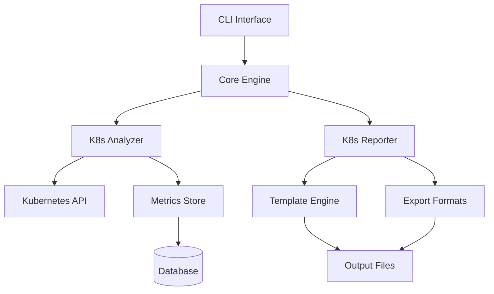

# Architecture

This document provides an overview of the K8s Tools architecture, including system design, component interactions, and implementation details.

## System Overview

K8s Tools follows a modular architecture with clear separation of concerns:



## Core Components

### 1. CLI Interface (`src/cli/`)

The command-line interface built with Click provides the main entry point:

- **Command Structure**: Hierarchical commands (`analyze`, `report`, `configure`)
- **Configuration Management**: YAML-based configuration with CLI overrides
- **Output Formatting**: Multiple output formats (JSON, YAML, HTML, PDF)

```python
# CLI structure example
@click.group()
def cli():
    """K8s Tools - Kubernetes Cluster Analysis and Reporting."""
    pass

@cli.command()
@click.option('--view', type=click.Choice(['cluster-overview', 'security']))
def analyze(view):
    """Analyze Kubernetes cluster."""
    pass
```

### 2. Core Engine (`src/core/`)

The core engine orchestrates analysis and reporting:

- **Configuration**: Centralized configuration management
- **Plugin System**: Extensible analysis views and exporters
- **Error Handling**: Comprehensive error handling and recovery
- **Logging**: Structured logging with configurable levels

### 3. K8s Analyzer (`src/analyzer/`)

The analyzer component handles Kubernetes cluster analysis:

#### Key Classes

```python
class ClusterAnalyzer:
    """Main analyzer for Kubernetes clusters."""
    
    def __init__(self, client: K8sClient, config: Config):
        self.client = client
        self.config = config
    
    def analyze(self, view: str) -> AnalysisResult:
        """Perform cluster analysis for specified view."""
        pass

class AnalysisView(ABC):
    """Abstract base class for analysis views."""
    
    @abstractmethod
    def analyze(self, cluster_data: ClusterData) -> ViewResult:
        """Analyze cluster data and return view-specific results."""
        pass
```

#### Analysis Views

Each view implements specific analysis logic:

- **Cluster Overview**: High-level cluster metrics and status
- **Security Analysis**: Security posture and vulnerability assessment
- **Resource Efficiency**: Resource utilization and optimization
- **Storage Analysis**: Persistent volume and storage metrics
- **Temporal Analysis**: Time-series analysis and trends

### 4. K8s Reporter (`src/reporter/`)

The reporter generates various output formats from analysis results:

#### Reporter Architecture

```python
class Reporter:
    """Main reporting engine."""
    
    def __init__(self, template_engine: TemplateEngine):
        self.template_engine = template_engine
        self.exporters = {}
    
    def generate_report(self, data: AnalysisResult, format: str) -> str:
        """Generate report in specified format."""
        pass

class TemplateEngine:
    """Jinja2-based template engine for reports."""
    
    def render_template(self, template: str, data: dict) -> str:
        """Render template with provided data."""
        pass
```

#### Export Formats

- **HTML**: Interactive dashboards with charts and tables
- **PDF**: Static reports for documentation
- **JSON/YAML**: Machine-readable data formats
- **CSV**: Tabular data for spreadsheet analysis

## Data Models

### Core Data Structures

```python
@dataclass
class ClusterData:
    """Complete cluster data snapshot."""
    nodes: List[NodeData]
    pods: List[PodData]
    services: List[ServiceData]
    deployments: List[DeploymentData]
    namespaces: List[NamespaceData]
    persistent_volumes: List[PVData]
    
    @property
    def total_nodes(self) -> int:
        return len(self.nodes)

@dataclass
class AnalysisResult:
    """Result of cluster analysis."""
    view_name: str
    timestamp: datetime
    cluster_info: ClusterInfo
    metrics: Dict[str, Any]
    recommendations: List[Recommendation]
    alerts: List[Alert]
```

### Kubernetes Resource Models

```python
@dataclass
class NodeData:
    """Kubernetes node information."""
    name: str
    status: NodeStatus
    capacity: ResourceCapacity
    allocatable: ResourceCapacity
    usage: ResourceUsage
    conditions: List[NodeCondition]
    labels: Dict[str, str]
    taints: List[Taint]

@dataclass
class PodData:
    """Kubernetes pod information."""
    name: str
    namespace: str
    status: PodStatus
    containers: List[ContainerData]
    resource_requests: ResourceRequests
    resource_limits: ResourceLimits
    node_name: str
```

## Plugin Architecture

### Analysis Views Plugin System

```python
class AnalysisViewRegistry:
    """Registry for analysis view plugins."""
    
    def __init__(self):
        self._views = {}
    
    def register(self, name: str, view_class: Type[AnalysisView]):
        """Register an analysis view plugin."""
        self._views[name] = view_class
    
    def get_view(self, name: str) -> AnalysisView:
        """Get analysis view instance by name."""
        if name not in self._views:
            raise ValueError(f"Unknown view: {name}")
        return self._views[name]()

# Usage
registry = AnalysisViewRegistry()
registry.register('security', SecurityAnalysisView)
registry.register('efficiency', ResourceEfficiencyView)
```

### Exporter Plugin System

```python
class ExporterRegistry:
    """Registry for export format plugins."""
    
    def register_exporter(self, format: str, exporter: Exporter):
        """Register export format handler."""
        self.exporters[format] = exporter
    
    def export(self, data: AnalysisResult, format: str) -> bytes:
        """Export data in specified format."""
        return self.exporters[format].export(data)
```

## Configuration Management

### Configuration Structure

```yaml
# config.yaml
cluster:
  name: "production"
  kubeconfig: "~/.kube/config"
  context: "production-cluster"

analysis:
  views:
    - cluster-overview
    - security-analysis
  metrics:
    collection_interval: "5m"
    retention_period: "7d"

output:
  format: "html"
  destination: "./reports/"
  template: "default"

database:
  url: "sqlite:///k8s-tools.db"
  pool_size: 10
```

### Configuration Loading

```python
class ConfigManager:
    """Centralized configuration management."""
    
    def __init__(self, config_file: Optional[str] = None):
        self.config_file = config_file or "config.yaml"
        self._config = None
    
    def load_config(self) -> Config:
        """Load configuration from file and environment."""
        if not self._config:
            self._config = self._load_from_file()
            self._apply_env_overrides()
        return self._config
    
    def _load_from_file(self) -> Dict:
        """Load configuration from YAML file."""
        with open(self.config_file, 'r') as f:
            return yaml.safe_load(f)
```

## Database Schema

### Metrics Storage

```sql
-- Node metrics table
CREATE TABLE node_metrics (
    id SERIAL PRIMARY KEY,
    timestamp TIMESTAMP DEFAULT CURRENT_TIMESTAMP,
    node_name VARCHAR(255) NOT NULL,
    cpu_capacity DECIMAL(10,2),
    memory_capacity BIGINT,
    cpu_usage DECIMAL(10,2),
    memory_usage BIGINT,
    pod_count INTEGER
);

-- Pod metrics table
CREATE TABLE pod_metrics (
    id SERIAL PRIMARY KEY,
    timestamp TIMESTAMP DEFAULT CURRENT_TIMESTAMP,
    pod_name VARCHAR(255) NOT NULL,
    namespace VARCHAR(255) NOT NULL,
    cpu_request DECIMAL(10,2),
    memory_request BIGINT,
    cpu_limit DECIMAL(10,2),
    memory_limit BIGINT,
    status VARCHAR(50)
);
```

## Security Considerations

### Authentication and Authorization

- **Kubernetes RBAC**: Respects cluster RBAC policies
- **Service Account**: Runs with minimal required permissions
- **Secret Management**: Secure handling of sensitive data

### Data Privacy

- **Local Processing**: Analysis performed locally when possible
- **Data Anonymization**: Option to anonymize cluster data
- **Secure Storage**: Encrypted storage for sensitive metrics

## Performance Optimization

### Caching Strategy

```python
class MetricsCache:
    """Cache for expensive Kubernetes API calls."""
    
    def __init__(self, ttl: int = 300):
        self.ttl = ttl
        self._cache = {}
    
    @lru_cache(maxsize=128)
    def get_nodes(self) -> List[NodeData]:
        """Get cached node data."""
        return self._fetch_nodes()
```

### Async Processing

```python
async def analyze_cluster_async(analyzer: ClusterAnalyzer) -> AnalysisResult:
    """Asynchronous cluster analysis."""
    tasks = []
    
    # Parallel data collection
    tasks.append(analyzer.collect_node_data())
    tasks.append(analyzer.collect_pod_data())
    tasks.append(analyzer.collect_service_data())
    
    results = await asyncio.gather(*tasks)
    return analyzer.process_results(results)
```

## Testing Architecture

### Test Structure

```
tests/
├── unit/           # Fast, isolated tests
├── integration/    # Component interaction tests
├── e2e/           # End-to-end workflow tests
└── fixtures/      # Test data and mocks
```

### Mock Strategy

- **Kubernetes API**: Mock using `unittest.mock`
- **External Services**: Use `responses` library
- **File System**: `tempfile` for temporary files
- **Time**: `freezegun` for time-based testing

## Deployment Patterns

### Standalone Tool

- **PyPI Package**: `pip install k8s-analyzer`
- **pipx Installation**: Isolated installation
- **Docker Container**: Containerized execution

### CI/CD Integration

- **GitHub Actions**: Automated analysis in workflows
- **Jenkins**: Pipeline integration
- **GitLab CI**: Scheduled cluster analysis

## Monitoring and Observability

### Logging

```python
import structlog

logger = structlog.get_logger(__name__)

def analyze_cluster(self, view: str):
    logger.info(
        "Starting cluster analysis",
        view=view,
        cluster=self.cluster_name
    )
```

### Metrics Collection

- **Internal Metrics**: Tool performance and usage
- **Cluster Metrics**: Kubernetes resource metrics
- **Error Tracking**: Exception monitoring and alerting

## Future Architecture Considerations

### Scalability

- **Multi-cluster Support**: Analyze multiple clusters
- **Distributed Processing**: Scale analysis across nodes
- **Real-time Updates**: Live cluster monitoring

### Extensibility

- **Custom Views**: User-defined analysis views
- **Plugin Marketplace**: Community-contributed plugins
- **API Endpoints**: REST API for programmatic access

## Related Documentation

- [Development Setup](setup.md)
- [Contributing Guidelines](contributing.md)
- [Testing Guide](testing.md)

<citations>
<document>
<document_type>RULE</document_type>
<document_id>mHRxidOov0WLb90jeiS2uG</document_id>
</document>
<document>
<document_type>RULE</document_type>
<document_id>FtUk1rgWdKE6veAClNpAqC</document_id>
</document>
</citations>
