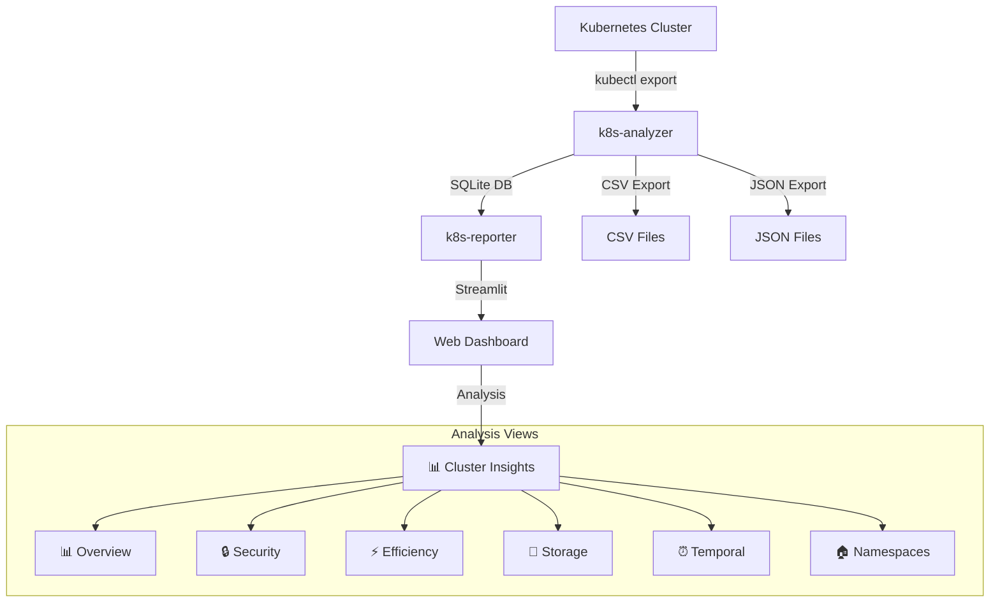

# 🚀 K8s Tools - Kubernetes Analysis & Reporting Suite

**Comprehensive Kubernetes Cluster Analysis and Reporting Tools for DevOps Engineers, SREs, and Platform Teams**

[](../LICENSE)
[](https://www.python.org/downloads/)
[](https://kubernetes.io/)

## Overview

K8s Tools is a powerful suite designed to provide deep insights into Kubernetes cluster operations through automated analysis and interactive reporting. The toolkit consists of two main components that work together to deliver comprehensive cluster intelligence.

### 🎯 Key Components

- **[k8s-analyzer](analyzer/overview.md)** - CLI tool for extracting and analyzing cluster data
- **[k8s-reporter](reporter/overview.md)** - Interactive web dashboard for visualization and insights

### ⭐ Key Benefits

- **🔍 Deep Cluster Insights** - Comprehensive resource relationship mapping
- **📈 Temporal Analysis** - Track resource lifecycle and creation patterns  
- **⚡ Resource Efficiency** - Identify optimization opportunities
- **💾 Storage Analytics** - Monitor storage consumption and capacity
- **🌐 Interactive Dashboard** - User-friendly Streamlit web interface
- **📊 Multiple Export Formats** - SQLite, CSV, and JSON outputs

## Quick Start

### Prerequisites

- Python 3.9+
- kubectl configured for your cluster
- [UV package manager](https://github.com/astral-sh/uv) (recommended)

### 1️⃣ Installation

```bash
# Install both tools using UV
uv tool install ./k8s-analyzer
uv tool install ./k8s-reporter

# Verify installation
k8s-analyzer --help
k8s-reporter --help
```

### 2️⃣ Analyze Your Cluster

```bash
# Export cluster data to SQLite
k8s-analyzer sqlite --output cluster-analysis.db

# Or export to CSV
k8s-analyzer csv --output-dir ./reports
```

### 3️⃣ Launch Interactive Dashboard

```bash
# Launch web interface
k8s-reporter --database cluster-analysis.db

# Access at http://localhost:8501
```

## Architecture Overview



## Use Cases

### 🔧 Operations & SRE
- **Cluster Health Monitoring** - Continuous resource health assessment
- **Capacity Planning** - Storage and resource utilization analysis
- **Incident Response** - Quick identification of problematic resources
- **Change Impact Assessment** - Before/after cluster state comparison

### 🛡️ Security & Compliance
- **RBAC Analysis** - Service account and permission auditing
- **Security Posture** - Identify pods without security contexts
- **Compliance Reporting** - Generate security and compliance reports
- **Vulnerability Assessment** - Track containers without resource limits

### 🚀 DevOps & Platform Engineering
- **Resource Optimization** - Identify over/under-provisioned resources
- **Cost Management** - Storage and compute efficiency analysis
- **Deployment Validation** - Ensure proper resource configurations
- **Multi-cluster Management** - Consistent analysis across environments

## What's Next?

- 📖 **[Get Started](getting-started.md)** - Detailed installation and setup guide
- 🔧 **[k8s-analyzer Guide](analyzer/overview.md)** - Learn about the analysis engine
- 🎨 **[k8s-reporter Guide](reporter/overview.md)** - Explore the web dashboard
- 📊 **[Analysis Views](analysis-views/overview.md)** - Understanding the different dashboards
- 💻 **[Development](development/setup.md)** - Contributing and development setup

## Community & Support

- 🐛 **[Report Issues](https://github.com/k8s-tools/k8s-tools/issues)**
- 💬 **[Discussions](https://github.com/k8s-tools/k8s-tools/discussions)**
- 📖 **[Changelog](../CHANGELOG.md)**
- 📄 **[License](../LICENSE)**

---

<div align="center">

**Made with ❤️ for the Kubernetes community**

[⭐ Star us on GitHub](https://github.com/k8s-tools/k8s-tools) • [📖 Documentation](.) • [💬 Get Support](https://github.com/k8s-tools/k8s-tools/issues)

</div>
