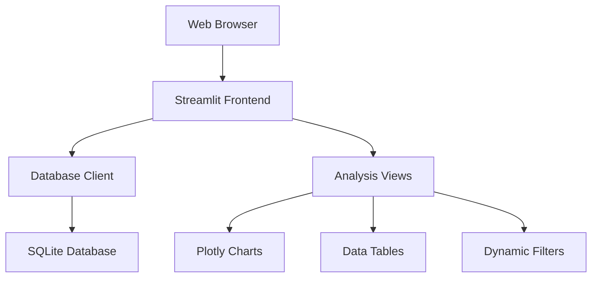

# 🎨 k8s-reporter Overview

The `k8s-reporter` is an interactive web dashboard built with Streamlit that provides comprehensive visualization and analysis of Kubernetes cluster data exported by `k8s-analyzer`. It offers multiple specialized views for different aspects of cluster analysis.

## Key Features

- **Interactive Web Dashboard**: Built with Streamlit for modern, responsive user experience
- **Multiple Analysis Views**: 10+ specialized dashboards for different analysis types
- **Real-time Filtering**: Dynamic data exploration with namespace, resource type, and health filters
- **Advanced Visualizations**: Plotly charts, network graphs, and interactive tables
- **Label-based Analysis**: Comprehensive labeling governance and application discovery
- **Export Capabilities**: Download reports and analysis data in various formats
- **Database Integration**: Seamless integration with k8s-analyzer SQLite databases

## Architecture



## Analysis Views

### 📊 Cluster Overview
- High-level cluster health and resource distribution
- Resource type breakdown with pie charts
- Top namespaces ranking
- Health ratio monitoring
- Issues summary dashboard

### 🔒 Security Analysis
- RBAC analysis and service account insights
- Pod security context evaluation
- Privileged containers detection
- Security recommendations
- ConfigMaps and Secrets overview

### 🏷️ Namespace Analysis
- Per-namespace resource breakdown
- Resource distribution within namespaces
- Health status per namespace
- Top resources identification
- Component relationship mapping

### ❤️ Health Dashboard
- Real-time health monitoring
- Health trends over time
- Issue identification and tracking
- Resource health distribution
- Health ratio tracking

### 🔗 Relationship Analysis
- Resource dependency mapping
- Relationship type distribution
- Interactive relationship matrix
- Search and filter capabilities
- Network graph visualization

### ⚡ Resource Efficiency
- Pod resource optimization analysis
- Detection of pods without resource requests/limits
- Severity classification (critical, high, medium, low)
- Resource coverage metrics
- Automated recommendations

### 💾 Storage Analysis
- Global storage consumption tracking
- Per-namespace storage breakdown
- Storage class analytics
- Volume status tracking (bound, available, pending)
- Access pattern analysis

### ⏰ Temporal Analysis
- Resource lifecycle tracking
- Creation timeline and age-based categorization
- Temporal patterns over time
- Age distribution analysis
- Most active namespaces

### 🏷️ Label Analysis
- Comprehensive label coverage analysis with quality scoring
- Common labels identification and usage patterns
- Multi-label resource analysis with statistical insights
- Orphaned resource detection without proper labels
- Label governance recommendations
- Interactive label filtering and search capabilities

### 🚀 Application View
- Automatic application discovery using standard Kubernetes labels
- Application health status and resource breakdowns
- Component identification and relationships within applications
- Orphaned resource identification and labeling recommendations
- Detailed per-application resource inventory and analysis
- Export functionality for governance reports

## Getting Started

### Launch the Dashboard

```bash
# Launch with a specific database
k8s-reporter --database cluster-analysis.db

# Launch on custom port
k8s-reporter --port 8080

# Launch for remote access
k8s-reporter --host 0.0.0.0 --port 8080
```

### Upload Database via Web UI

1. Launch k8s-reporter without specifying a database
2. Use the file uploader in the sidebar
3. Upload your `.db` file generated by k8s-analyzer

### Navigation and Filtering

- **View Selection**: Choose from 8+ analysis views in the sidebar
- **Namespace Filter**: Filter data by specific namespaces
- **Resource Type Filter**: Focus on specific Kubernetes resource types
- **Health Status Filter**: Show only healthy, warning, or error resources
- **Search**: Find specific resources by name or type

## Advanced Features

### Interactive Visualizations

- **Hover Tooltips**: Detailed information on chart elements
- **Clickable Legends**: Toggle data series on/off
- **Responsive Design**: Optimized for desktop, tablet, and mobile
- **Real-time Updates**: Refresh data without page reload

### Data Export

```bash
# Export filtered data to CSV
# Available through the web interface in each view
```

### Custom Configuration

```bash
# Environment variables
export K8S_REPORTER_DATABASE="/path/to/cluster.db"
export STREAMLIT_SERVER_PORT="8501"
export STREAMLIT_SERVER_ADDRESS="localhost"

# CLI options
k8s-reporter --help

Options:
  --port         Port to run the app (default: 8501)
  --host         Host to bind the app (default: localhost)
  --database     Path to SQLite database file
  --headless     Run without opening browser
  --debug        Enable debug logging
```

## Use Cases

### Operations Teams
- **Daily Health Checks**: Monitor cluster health with the overview dashboard
- **Incident Response**: Quickly identify problematic resources using health filters
- **Capacity Planning**: Analyze storage consumption and resource efficiency

### Security Teams
- **Security Audits**: Use the security analysis view for RBAC and pod security assessment
- **Compliance Reporting**: Generate security posture reports
- **Vulnerability Assessment**: Identify containers without proper security configurations

### Platform Engineers
- **Resource Optimization**: Identify over/under-provisioned resources
- **Cost Management**: Analyze storage and compute efficiency
- **Architecture Review**: Understand resource relationships and dependencies

### DevOps Engineers
- **Deployment Validation**: Ensure proper resource configurations
- **Multi-cluster Comparison**: Compare configurations across environments
- **Change Impact Assessment**: Analyze before/after cluster states

## Integration

### With k8s-analyzer

```bash
# Generate database with k8s-analyzer
k8s-analyzer sqlite cluster-export.json --output cluster.db

# Analyze with k8s-reporter
k8s-reporter --database cluster.db
```

### CI/CD Integration

```bash
# Automated reporting in pipelines
k8s-reporter --database cluster.db --headless --host 0.0.0.0
```

### Docker Deployment

```dockerfile
FROM python:3.11-slim

# Install k8s-reporter
COPY k8s-reporter /app/k8s-reporter
WORKDIR /app/k8s-reporter
RUN pip install -e .

# Expose port
EXPOSE 8501

# Run the application
CMD ["k8s-reporter", "--host", "0.0.0.0", "--port", "8501"]
```

## Development

### Local Development

```bash
# Clone and setup
git clone https://github.com/k8s-tools/k8s-reporter.git
cd k8s-reporter

# Install dependencies
uv sync --all-extras

# Run in development mode
uv run streamlit run src/k8s_reporter/app.py

# Run tests
uv run pytest

# Code formatting
uv run black src tests
uv run isort src tests
```

### Adding New Views

1. Create a new view module in `src/k8s_reporter/views/`
2. Implement the view function following the established pattern
3. Add the view to the `ANALYSIS_VIEWS` configuration
4. Update the navigation and documentation

### Custom Visualizations

```python
import plotly.express as px
import streamlit as st

def create_custom_chart(data):
    """Create a custom Plotly chart."""
    fig = px.bar(data, x='category', y='value', title='Custom Analysis')
    st.plotly_chart(fig, use_container_width=True)
```

## Performance Optimization

### For Large Datasets
- Use pagination for large tables
- Implement lazy loading for expensive queries
- Cache expensive computations using Streamlit's `@st.cache_data`

### Database Optimization
- Ensure proper SQLite indexes
- Use efficient queries with appropriate WHERE clauses
- Implement connection pooling for high-traffic scenarios

## Troubleshooting

### Common Issues

#### Port Already in Use
```bash
# Check what's using the port
netstat -an | grep 8501

# Use a different port
k8s-reporter --port 8080
```

#### Database Connection Issues
```bash
# Verify database file exists and is readable
ls -la cluster.db
sqlite3 cluster.db ".tables"

# Check file permissions
chmod 644 cluster.db
```

#### Performance Issues
```bash
# Enable debug mode for detailed logging
k8s-reporter --debug

# Use a smaller dataset for testing
k8s-analyzer sqlite small-cluster.json --output test.db
```

## Future Enhancements

### Planned Features
- **Custom Dashboards**: User-defined dashboard creation
- **Real-time Monitoring**: Live cluster connection
- **Multi-cluster Support**: Compare multiple clusters
- **Alert Integration**: Integration with monitoring systems
- **PDF Reports**: Automated report generation

### Roadmap
- **v1.0**: Enhanced visualizations and export capabilities
- **v1.1**: Real-time cluster monitoring
- **v1.2**: Multi-cluster comparison features
- **v2.0**: Advanced analytics and machine learning insights

## Support and Contributing

- **Issues**: Report bugs and feature requests on [GitHub Issues](https://github.com/k8s-tools/k8s-reporter/issues)
- **Discussions**: Join the community on [GitHub Discussions](https://github.com/k8s-tools/k8s-reporter/discussions)
- **Contributing**: See the [development guide](../development/setup.md) for contribution guidelines
- **Documentation**: Help improve documentation and examples
